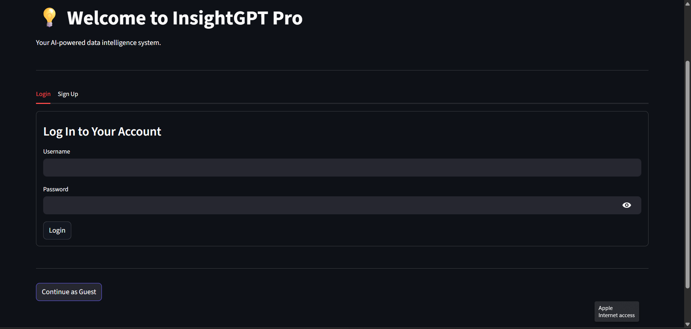
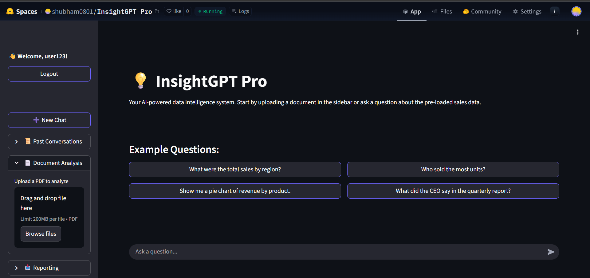
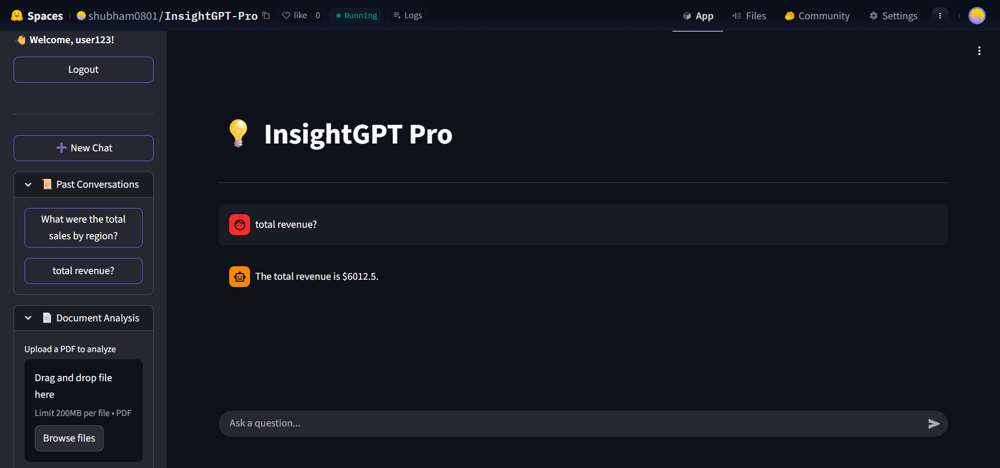

# 💡 InsightGPT Pro

[](https://www.python.org/) [](https://fastapi.tiangolo.com/) [](https://streamlit.io/) []()

An autonomous, LLM-powered data intelligence system that securely understands, analyzes, visualizes, and reports on your business data.

---

<p align="center">
  
  <br/>
  <em>A full-stack, AI-powered data analyst application.</em>
</p>

## 🚀 Live Demo

**You can access the live, deployed application here:**

**[https://huggingface.co/spaces/shubham0801/InsightGPT-Pro](https://huggingface.co/spaces/shubham0801/InsightGPT-Pro)**

---

## ✨ Key Features

- **Secure Multi-User System:** Full user sign-up, login, and guest access modes using JWT for secure API communication.
- **Persistent Memory:** Chat histories for logged-in users are saved across sessions using a cloud Redis instance.
- **Advanced Multi-Agent Architecture:** Powered by LangGraph, a "Router" agent intelligently delegates user queries to specialized agents:
    - **SQL Agent:** Analyzes and queries structured data from a database.
    - **RAG Agent:** Performs semantic search on user-uploaded PDF documents.
- **Dynamic Document Analysis:** Users can upload their own PDF documents on the fly for the agent to analyze and answer questions about.
- **Interactive Visualizations:** The agent can generate interactive bar and pie charts using Plotly when asked for a visual representation of data.
- **Automated PDF Reporting:** Users can download their entire chat session, including text and generated charts, as a clean, professional PDF report.

---

## 🏛️ System Architecture


The application is built on a modern, decoupled full-stack architecture. The Streamlit frontend communicates with a FastAPI backend via a REST API. The backend orchestrates a multi-agent system built with LangGraph, which leverages different tools to interact with data sources like SQLite, FAISS, and the Google Gemini LLM.

---

## 🛠️ Tech Stack

| Layer                 | Technologies & Frameworks                                        |
| --------------------- | ---------------------------------------------------------------- |
| **Frontend** | Streamlit                                                        |
| **Backend** | FastAPI, Uvicorn, Python 3.12                                    |
| **AI & Orchestration**| LangChain, LangGraph, Google Gemini                              |
| **Databases** | SQLite (User & Sales Data), Redis (Chat History), FAISS (Vector DB)|
| **Embeddings** | Sentence-Transformers (`all-MiniLM-L6-v2`)                       |
| **Authentication** | JWT (python-jose), Passlib (bcrypt)                              |
| **Visualizations** | Plotly                                                           |
| **Reporting** | ReportLab                                                        |
| **Deployment** | Docker, Hugging Face Spaces                                      |

---

## ⚙️ Local Setup and Installation

To run this project locally, follow these steps:

1.  **Clone the repository:**
    ```bash
    git clone [https://github.com/YOUR_USERNAME/InsightGPT-Pro.git](https://github.com/YOUR_USERNAME/InsightGPT-Pro.git)
    cd InsightGPT-Pro
    ```
2.  **Create and activate a virtual environment:**
    ```bash
    python -m venv venv
    # On Windows:
    .\venv\Scripts\activate
    # On macOS/Linux:
    source venv/bin/activate
    ```
3.  **Install dependencies:**
    ```bash
    pip install -r requirements.txt
    ```
4.  **Set up your environment variables:**
    * Copy `.env.example` to a new file named `.env`.
    * Add your `GOOGLE_API_KEY`, a unique `JWT_SECRET_KEY`, and your Redis connection details.
    ```bash
    cp .env.example .env
    ```
5.  **Initialize the database:**
    * This will create the `analytics.db` file and populate it with sample data.
    ```bash
    python scripts/ingest_data.py
    python scripts/init_db.py
    ```
6.  **Run the application:**
    * In **one terminal**, start the backend server:
        ```bash
        uvicorn app.main:app --reload
        ```
    * In a **second terminal**, start the frontend server:
        ```bash
        streamlit run frontend/app.py
        ```
7.  Open your browser to `http://localhost:8501`.

---

## 📸 Application Screenshots

*[Add 2-3 of your best screenshots here. Show the main chat interface with a chart, the sidebar with a document loaded, and the login page.]*

<p align="center">
  
  
  
</p>